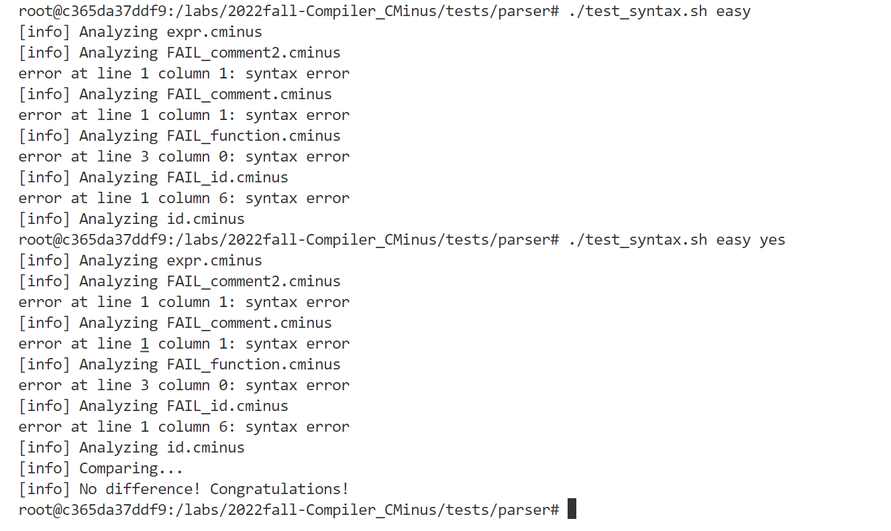
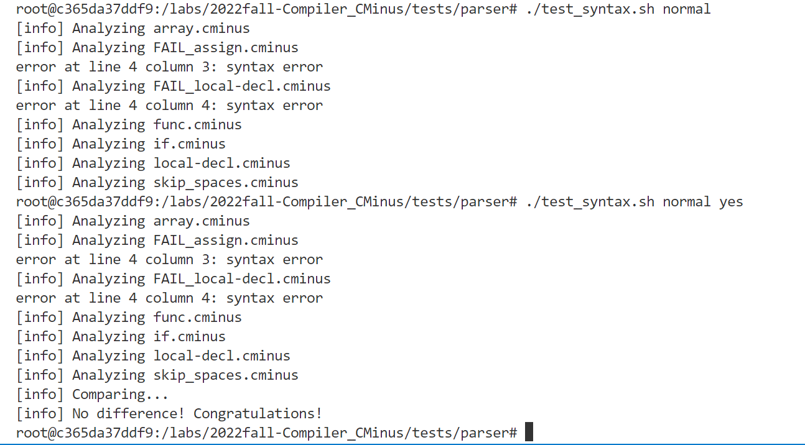
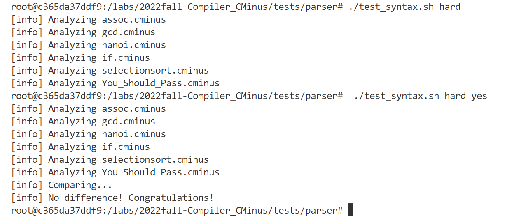
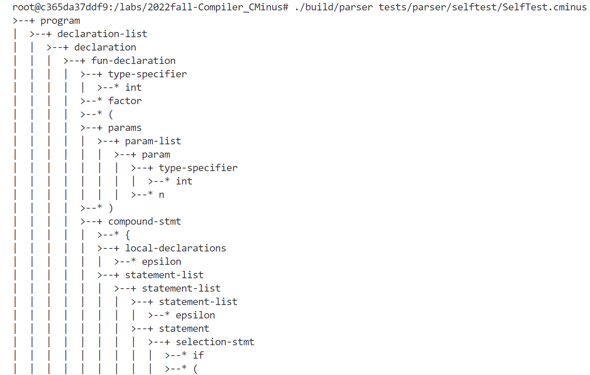
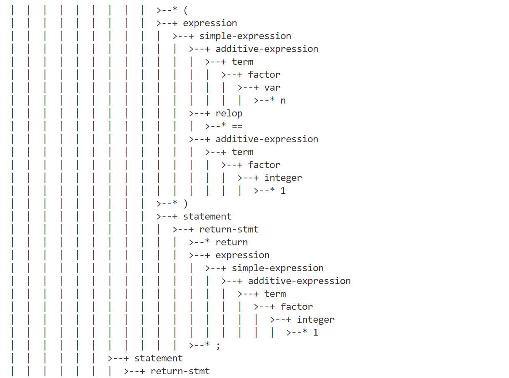
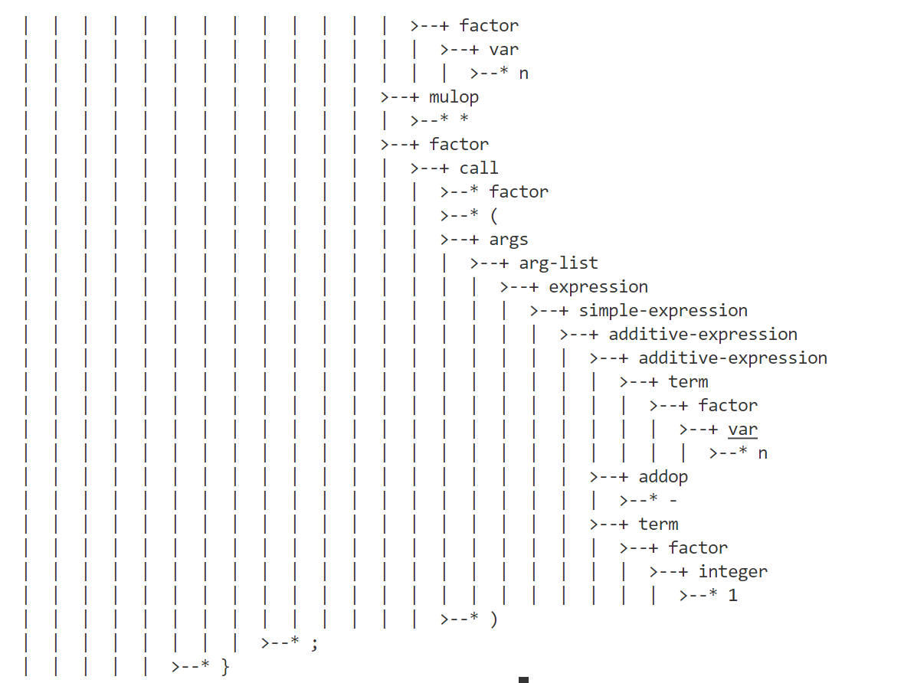

# lab1 实验报告
学号 PB20000287 姓名 殷明

## 实验要求
本次实验需要从无到有完成一个完整的 Cminus-f 解析器，包括基于 flex 的词法分析器和基于 bison 的语法分析器。
## 实验难点
+ 理解语法树的构造过程，并正确的建立相映射。
+ 在词法分析中要注意对所有的字符进行转义。
## 实验设计
### 词法分析器
词法分析器的本质就是对于给定的源代码文件，能够将其转化为词法记号流。

只需补全模式和动作即可，能够输出识别出的token，text ,line(刚出现的行数)，pos_start(该行开始位置)，pos_end(结束的位置)即可，比较简单。


### 语法分析器

paser的主要功能就是将输入文本转化成抽象语法树，打印语法树的代码在文件中已经给出，所以我们只需要补全相应转换规则即可，所以我们只需要根据代码中的提示和基础知识中给出的文法填写相应的规则即可。如果最后实现成功，能生成语法树。

## 实验结果验证
### 脚本自动测试：
+ esay部分：


+ normal部分：


+ hard 部分：

### 自行设计的测试 
代码如下：
```
int factor(int n){
    if(n==1) return 1;
    return n*factor(n-1);
}

```
递归程序测试结果：




经检验，实验结果正确。
## 实验反馈
本次实验比较简单，主要考察了对词法分析和语法分析的理解。实验设计的很好，能很好的帮助学生理解词法分析器和语法分析器。并提供自动化脚本进行辅助测试，能大大节省时间。