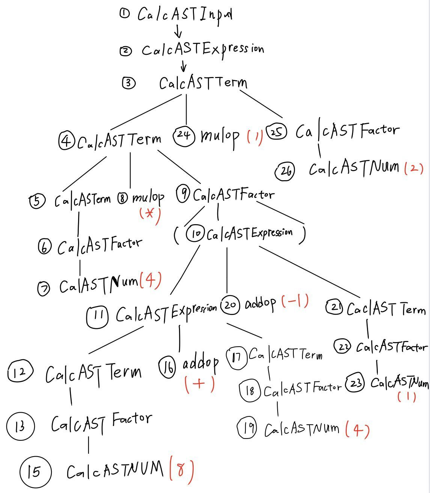
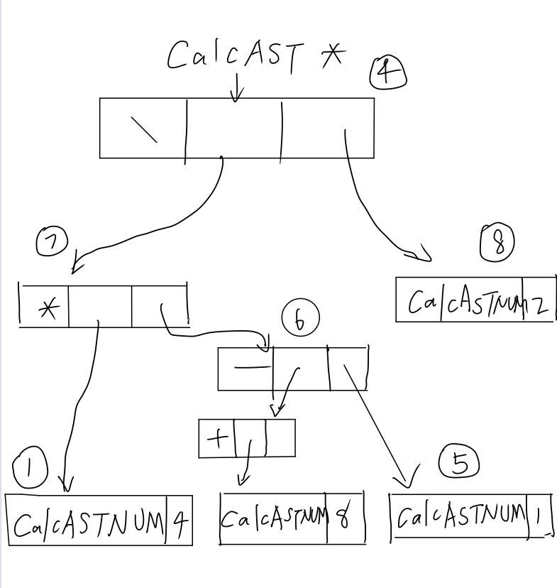

# lab2 实验报告
学号 PB20000287  姓名 殷明

## 问题1: getelementptr
请给出 `IR.md` 中提到的两种 getelementptr 用法的区别,并稍加解释:
  - `%2 = getelementptr [10 x i32], [10 x i32]* %1, i32 0, i32 %0`
  - `%2 = getelementptr i32, i32* %1 i32 %0`
 ​	两种用法的不同主要是作为GEP指令，他们的可重复参数部分不同，第一个使用了两个\<type\> \<idx\>对，第二个只使用了一个。

    ​	这两者出现区别的原因在于%1类型的不同:

    1. 第一行里面%1为\[10 x i32\]\*类型，第一个`i32 0`表示首先在这个数组指针的地址处取0偏移量，此时可以认为是打开成i32的指针了，后一个``i32 %0``表示从第一层打开得到的i32\*的地址处取%0偏移量，最终得到i32\*的%2
    2. 第二行里面的%1就是i32\*类型，所以唯一一个参数`i32 %0`表示从%1地址处取%0的偏移量，得到i32 *的%2

    

## 问题2: cpp 与 .ll 的对应
请说明你的 cpp 代码片段和 .ll 的每个 BasicBlock 的对应关系。


1. ### `assign_generator.cpp` & `assign_hand.ll`

   - #### 只有一个`main()`函数：

     ```c
         // main函数
        std::vector<Type *> Ints(0);
        auto Main = Function::create( FunctionType::get(Int32Type,Ints),"main",module);
     ```

     这部分对应：

     ```llvm
     define dso_local i32 @main() #0 {
     	// 函数体
     }
     ```


     - **`main()`函数内只有一个BasicBlock：**

        ```c++
            
        auto bb = BasicBlock::create(module,"entry",Main);
        builder->set_insert_point(bb);

        auto ArrayAlloca = builder->create_alloca(ArrayType::get(Int32Type,10));
        auto retAlloca = builder->create_alloca(Int32Type);

        auto Arr0 = builder->create_gep(ArrayAlloca,{CONST_INT(0),CONST_INT(0)});
        builder->create_store(CONST_INT(10),Arr0);
        auto Arr1 = builder->create_gep(ArrayAlloca,{CONST_INT(0),CONST_INT(1)});
        auto Load_value0 = builder->create_load(Arr0);
        auto mul = builder->create_imul(Load_value0,CONST_INT(2));
        builder->create_store(mul,Arr1);

        auto Load_value1 = builder->create_load(Arr1);
        builder->create_store(Load_value1,retAlloca);

        auto retLoad = builder->create_load(retAlloca);
        builder->create_ret(retLoad);
       ```

       这部分对应：

       ```llvm
        %1 = alloca i32, align 4                                           
        %2 = alloca [10 x i32], align 4                               ;分配数组
        store i32 0, i32* %1, align 4     
        %3 = getelementptr [10 x i32], [10 x i32]* %2, i32 0, i32 0   ;获取A[0]的地址
        store i32 10, i32* %3, align 4                                ;将 A[0]赋值为10
        %4 = getelementptr  [10 x i32], [10 x i32]* %2, i32 0, i32 1  ;获取 A[1] 的地址
        %5 = load i32, i32* %3, align 4                                    
        %6 = mul i32 2, %5                                            ;计算 2 * A[0]
      
        store i32 %6, i32* %4, align 4     
        %7 = load i32, i32* %4, align 4                               ;返回值
        ret i32 %7    
       ```

   
2. ### `fun_generator.cpp`&`fun_hand.ll`

   - #### 函数一`callee()`：

     ```c++
        Type *Int32Type = Type::get_int32_type(module);
        std::vector<Type *> Ints(1, Int32Type);
        auto calleeFun = Function::create(FunctionType::get(Int32Type, Ints),"callee", module);

     ```

     这部分对应：

     ```llvm
     define dso_local i32 @callee(i32 %0){
     	//函数体
     }
     
     ```

     - **`callee`函数内只有一个BasicBlock:**

       ```c++
            
        auto bb = BasicBlock::create(module, "calleefunc", calleeFun);
        builder->set_insert_point(bb);
        auto retAlloca = builder->create_alloca(Int32Type);
        auto aAlloca = builder->create_alloca(Int32Type);
        std::vector<Value *> args;
        for (auto arg = calleeFun->arg_begin(); arg != calleeFun->arg_end(); arg++) {
            args.push_back(*arg);
        }
        builder->create_store(args[0], aAlloca);
        auto aValue = builder->create_load(aAlloca);
        auto mul = builder->create_imul(aValue, CONST_INT(2));
        builder->create_store(mul, retAlloca);

        auto retLoad = builder->create_load(retAlloca);
        builder->create_ret(retLoad);

       ```

       这部分对应：

       ```llvm
        %1 = alloca i32, align 4
        %2 = alloca i32, align 4                   
        store i32 %0, i32* %2
        %3 = load i32, i32* %2                       ;a[1]=a[0]*2
        %4 = mul i32 %3, 2                           ;计算返回值
        ret i32 %4
       ```

   - #### 函数二`main()`：

     ```c++
         // main函数
         auto mainFun = Function::create(FunctionType::get(Int32Type,{}),"main",module);
         bb = BasicBlock::create(module,"entry",mainFun);
     ```

     这部分对应：

     ```llvm
     define dso_local i32 @main(){
     	//函数体
     }
     ```

     - **`main()`函数中只有一个BasicBlock:**

       ```c++
        builder->set_insert_point(bb);
       	retAlloca = builder->create_alloca(Int32Type);
       	auto callLoad = builder->create_call(calleeFun,{CONST_INT(110)});
        builder->create_ret(calling);
       ```

       这部分对应：

       ```llvm
        %1 = call i32 @callee(i32 110)              ;获取返回值
        ret i32 %1
       ```

       

3. ### `if_gengerator.cpp`&`if_hand.ll`

   - #### 只有一个`main()`函数：

     ```c++
         auto mainFun = Function::create(FunctionType::get(Int32Type,{}),"main",module);
         auto bb = BasicBlock::create(module,"entry",mainFun);
     ```

     这部分对应：

     ```llvm
     define dso_local i32 @main(){
     	//函数体
     }
     ```

     - **`main()`函数中有四个BasicBlock,分别为`mainBB`,`trueBB`,`falseBB`,`retBB`:**

       - **前置的定义部分`pre-definition BasicBlock`:**

         ```c++
             // pre-definition BasicBlock
            auto trueBB = BasicBlock::create(module, "", mainFun);   
            auto falseBB = BasicBlock::create(module, "", mainFun);  
            auto retBB = BasicBlock::create(module, "", mainFun);
         ```

         这部分在`.ll`中不好找出对应部分

       - **`mainBB` BasicBlock:**

         ```c++
            auto bb = BasicBlock::create(module, "entry", mainFun);
            builder->set_insert_point(bb);
            auto retAlloca = builder->create_alloca(Int32Type);
            auto Addr = builder->create_alloca(FloatType);
            builder->create_store(CONST_FP(0x40B1C28FE0000000), Addr);
            auto aValue = builder->create_load(Addr);
            auto icmp = builder->create_fcmp_gt(aValue, CONST_FP(1.0));
           	auto br = builder->create_cond_br(icmp, trueBB, falseBB);
         ```

         这部分对应：

         ```llvm
            %1 = alloca float, align 4  
            %2 = alloca i32, align 4                                        
            store float 0x40163851E0000000, float* %1 ,align 4      ;store 5.555
            %3 = load float, float* %1, align 4                     
            %4 = fcmp ugt float %3, 1.0                             ;compare
            br i1 %4, label %6, label %8                            ;branch

         ```

       - **`trueBB` BasicBlock:**

         ```c++
             // trueBB
             builder->set_insert_point(trueBB);
             builder->create_store(CONST_INT(233),retAlloca);
             builder->create_br(retBB);
         ```

         这部分对应：

         ```llvm
         5:
             store i32 233, i32* %2
             br label %7
         ```

       - **`falseBB` BasicBlock:**

         ```c++
             // falseBB
             builder->set_insert_point(falseBB);
             builder->create_store(CONST_INT(0),retAlloca);
             builder->create_br(retBB);
         ```

         这部分对应：

         ```llvm
         6:
             store i32 0, i32* %2
             br label %7
         ```

       - **`retBB` BasicBlock:**

         ```c++
             // retBB
             builder->set_insert_point(retBB);
             auto retLoad = builder->create_load(retAlloca);
             builder->create_ret(retLoad);
         ```

         这部分对应：

         ```llvm
         7:
             ; 取%2, 返回
             %8 = load i32, i32* %2
             ret i32 %8
         ```

         

4. ### `while_generator.cpp`

   - #### 只有一个`main()`函数:

     ```c++
         auto mainFun = Function::create(FunctionType::get(Int32Type, {}),"main",module);
         auto bb = BasicBlock::create(module,"entry",mainFun);
     ```

     这部分对应：

     ```llvm
     define dso_local i32 @main(){
     	//函数体
     }
     ```

     - **`main()`函数中有四个BasicBlock,分别为`mainBB`,`cmpBB`,`trueBB`,`retBB`:**

       - **前置的定义部分`pre-definition BasicBlock`:**

         ```c++
             
             auto cmpBB = BasicBlock::create(module,"",mainFun);
             auto trueBB = BasicBlock::create(module,"",mainFun);
             auto retBB = BasicBlock::create(module,"",mainFun);
         ```

         这部分在`.ll`中不好对应代码

       - **`mainBB` BasicBlcok:**

         ```c++
             builder->set_insert_point(bb);
         
             auto retAlloca = builder->create_alloca(Int32Type);
             auto aAlloca = builder->create_alloca(Int32Type);
             auto iAlloca = builder->create_alloca(Int32Type);
         
             builder->create_store(CONST_INT(10),aAlloca);
             builder->create_store(CONST_INT(0),iAlloca);
             auto br = builder->create_br(cmpBB); 
         ```

         这部分对应:

         ```llvm
             ; %1%2%3 指向a,i,返回值
             %1 = alloca i32, align 4
             %2 = alloca i32, align 4
             %3 = alloca i32, align 4
             ; 给a,i赋初值
             store i32 10, i32* %1
             store i32 0, i32* %2
             ; 比较 i < 10
             br label %4
         ```

       - **`cmpBB` BasicBlock:**

         ```c++
             // cmpBB 
             builder->set_insert_point(cmpBB);
             auto iLoad = builder->create_load(iAlloca);
             auto icmp = builder->create_icmp_lt(iLoad,CONST_INT(10));
             builder->create_cond_br(icmp,trueBB,retBB);
         ```

         这部分对应：

         ```llvm
         3:
            %4 = load i32, i32* %2                                  ;load i
            %5 = icmp slt i32 %4, 10                                ;比较i和10的大小
            br i1 %5, label %6, label %11                           ;branch
         ```

       - **`trueBB` BasicBlcok:**

         ```c++
             // trueBB
             builder->set_insert_point(trueBB);
             iLoad = builder->create_load(iAlloca);
             auto add = builder->create_iadd(iLoad,CONST_INT(1));
             builder->create_store(add,iAlloca);
         
             iLoad = builder->create_load(iAlloca);
             auto aLoad = builder->create_load(aAlloca);
             add = builder->create_iadd(iLoad,aLoad);
             builder->create_store(add,aAlloca);
             builder->create_br(cmpBB);
         ```

         这部分对应：

         ```llvm
          6:
          %7 = load i32, i32* %2                       
          %8 = add i32 %7, 1                                      
          store i32 %8, i32* %2                       
          %9 = load i32, i32* %1                     
          %10 = add i32 %9, %8                                   
          store i32 %10, i32* %1                     
          br label %3                                   ;loop
         ```

       - **`retBB` BasicBlcok:**

         ```c++
             // retBB
             builder->set_insert_point(retBB);
             aLoad = builder->create_load(aAlloca);
             builder->create_store(aLoad,retAlloca);
             auto retLoad = builder->create_load(retAlloca);
             builder->create_ret(retLoad);
         ```

         这部分对应：

         ```llvm
          11:
          %12 = load i32, i32* %1                               
          ret i32 %12                              ;return
         ```

         

## 问题3: Visitor Pattern
分析 `calc` 程序在输入为 `4 * (8 + 4 - 1) / 2` 时的行为：
1. 请画出该表达式对应的抽象语法树（使用 `calc_ast.hpp` 中的 `CalcAST*` 类型和在该类型中存储的值来表示），并给节点使用数字编号。
2. 请指出示例代码在用访问者模式遍历该语法树时的遍历顺序。

序列请按如下格式指明（序号为问题 3.1 中的编号）：  
3->2->5->1<br>
1.**先画出语法分析树：**


 **再根据语法分析树画出抽象语法树：**


2.<br>
遍历顺序为1~9
## 实验难点
描述在实验中遇到的问题、分析和解决方案。<br>

对C++的一些性质不太熟悉，花费了一些时间去学习C++的相关内容。
## 实验反馈
吐槽?建议?<br>
本次实验难度适中，为后面的实验打下了比较良好的基础。
